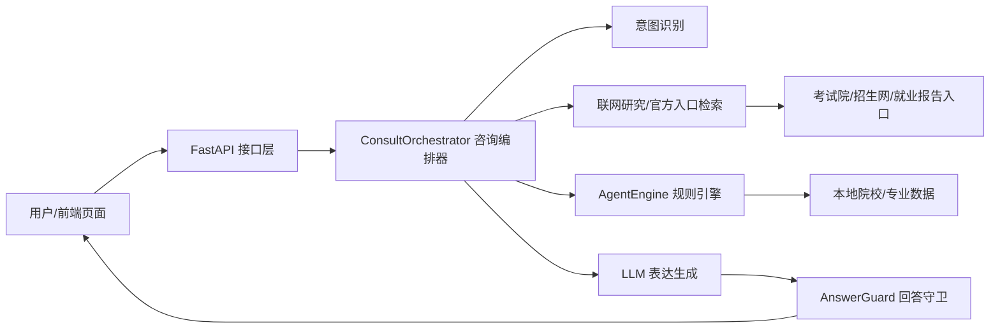

# 志愿智选


志愿智选是一套面向高考志愿填报场景的 AI 咨询与决策辅助系统。项目围绕“考生画像、院校专业匹配、志愿方案审核、就业价值洞察、数据核验”构建，帮助用户从分数、位次、家庭条件、城市偏好、专业方向和长期职业回报等维度理解志愿选择。

> 内容由 AI 生成，仅供参考；涉及录取、招生计划、专业组、就业质量和薪资等信息时，应结合省教育考试院、阳光高考、学校本科招生网和就业质量报告进行最终确认。

## 项目亮点

- **AI 志愿顾问**：支持自然语言咨询，能围绕考生画像回答学校、专业、就业、薪资、中位数、500 强招聘和 10 年后压力测试等问题。
- **考生画像建模**：支持省份、分数、位次、选科、城市偏好、家庭条件、专业方向和风险偏好等关键字段。
- **冲稳保推荐**：根据本地院校/专业库和规则引擎生成志愿候选，区分冲刺、稳妥、保底档位。
- **志愿审核台**：对推荐方案进行风险复核，展示官方核验入口、关键缺失数据、风险标签和家庭分流建议。
- **高校目录**：按省份/地区浏览高校，支持高校检索和层次标签展示。
- **职业洞察**：从平均薪资、就业稳定性、岗位需求热度、5 年成长潜力、专业匹配度等维度分析专业价值。
- **回答守卫机制**：避免 AI 跑题、乱推荐学校、暴露内部技术词或把估算数据说成官方结论。

## 界面模块

项目当前页面形态参考截图，主要包括以下模块：

| 模块 | 说明 |
| --- | --- |
| 模拟推荐 | 以聊天方式进行志愿咨询，支持快捷问题、AI 回复、画像侧栏和多轮会话 |
| 考生画像 | 通过弹窗收集省份、分数、位次、选科、城市偏好、风险偏好等信息 |
| 高校目录 | 展示全国高校目录，支持地区筛选、关键词搜索和高校层次标签 |
| 方案同步 | 展示志愿审核台，对候选方案进行冲稳保、风险标签、官方核验和缺失数据检查 |
| 职业洞察 | 展示专业背后的就业价值，包括高薪职业、稳定职业、城市薪资对比和岗位趋势 |

## 技术栈

### 后端

- FastAPI
- Uvicorn
- Pydantic v2
- DeepSeek / Anthropic LLM 接入
- 本地规则引擎与数据检索
- 内存会话管理与限流中间件

### 前端

- 单文件前端应用：`zhiyuan-agent.html`
- 无构建依赖，直接通过浏览器打开即可使用
- 默认调用后端接口：`http://127.0.0.1:8000`

### 数据

- `data/schools.json`：高校基础数据
- `data/majors.json`：专业就业、薪资、壁垒和风险数据
- `data/school_admissions_urls.json`：学校招生网入口
- `高校省市地址 (1).json`：高校省市辅助数据

## 系统架构



当前实现属于“单编排器 + 多 Agent 能力模块”的轻量级智能体架构。核心能力包括：

- 推荐 Agent：生成冲稳保候选方案
- 对比 Agent：对多个志愿方案进行横向比较
- 洞察 Agent：分析学校或专业的就业价值
- 压力测试 Agent：模拟 10 年后专业风险
- 回答守卫 Agent：修正跑题、夸大、技术词外露等问题

## 目录结构

```text
.
├── api/                      # FastAPI 路由
│   ├── agent.py              # Agent 能力接口
│   ├── consult.py            # AI 咨询接口
│   ├── data.py               # 数据查询接口
│   ├── evaluate.py           # 决策评估接口
│   └── sessions.py           # 会话接口
├── core/                     # 核心业务逻辑
│   ├── agent_engine.py       # 推荐、洞察、对比、压力测试规则引擎
│   ├── answer_guard.py       # 回答安全与一致性守卫
│   ├── consult_orchestrator.py # 咨询主编排器
│   ├── family_risk.py        # 家庭风险画像
│   ├── llm_client.py         # LLM 调用与兜底回答
│   ├── research_client.py    # 联网搜索与来源摘要
│   ├── session_manager.py    # 会话管理
│   └── zxf_engine.py         # 决策评估与追问逻辑
├── data/                     # 本地数据
├── middleware/               # 日志、限流、异常处理
├── prompts/                  # 系统提示词
├── tests/                    # 单元测试
├── main.py                   # FastAPI 应用入口
├── requirements.txt          # Python 依赖
└── zhiyuan-agent.html        # 前端页面
```

## 快速开始

### 1. 安装依赖

```powershell
python -m venv .venv
.\.venv\Scripts\Activate.ps1
pip install -r requirements.txt
```

### 2. 配置环境变量

在项目根目录创建 `.env`，按需配置：

```env
LLM_PROVIDER=deepseek
DEEPSEEK_API_KEY=你的 DeepSeek Key
DEEPSEEK_MODEL=deepseek-v4-pro
DEEPSEEK_BASE_URL=https://api.deepseek.com/chat/completions

LLM_TIMEOUT=40
RESEARCH_TIMEOUT=6
RATE_LIMIT_WINDOW=60
RATE_LIMIT_MAX=30
```

如果不配置 LLM Key，系统仍可使用部分本地规则和兜底逻辑，但 AI 咨询效果会下降。

### 3. 启动后端

```powershell
python -m uvicorn main:app --host 127.0.0.1 --port 8000
```

健康检查：

```powershell
Invoke-RestMethod http://127.0.0.1:8000/health
```

### 4. 打开前端

直接用浏览器打开：

```text
zhiyuan-agent.html
```

前端默认请求本地后端 `http://127.0.0.1:8000`。

## 主要接口

| 接口 | 方法 | 说明 |
| --- | --- | --- |
| `/health` | GET | 后端健康检查 |
| `/api/consult` | POST | AI 咨询主接口 |
| `/api/consult/stream` | POST | 流式咨询接口 |
| `/api/agent/recommend` | POST | 智能志愿推荐 |
| `/api/agent/compare` | POST | 志愿方案对比 |
| `/api/agent/insights` | POST | 学校/专业洞察 |
| `/api/agent/pressure-test` | POST | 10 年后压力测试 |
| `/api/agent/analyze` | POST | 深度分析 |
| `/api/data/schools` | GET | 高校数据 |
| `/api/data/majors` | GET | 专业数据 |
| `/api/sessions` | GET/POST | 会话列表与创建 |

## 示例请求

```powershell
$body = @{
  question = "这个专业的中位数收入多少？"
  context = @{
    province = "上海"
    score = 543
    rank = 14299
    subjects = "物化生"
    family_background = "普通家庭"
    city_preference = @("上海")
    major_preference = @("物理学")
    risk_appetite = "稳妥"
  }
} | ConvertTo-Json -Depth 5

Invoke-RestMethod `
  -Uri http://127.0.0.1:8000/api/consult `
  -Method Post `
  -Body $body `
  -ContentType "application/json; charset=utf-8"
```

## 测试

运行核心咨询契约测试：

```powershell
$env:PYTHONDONTWRITEBYTECODE='1'
python -m unittest -v tests.test_consult_intent_contracts
```

当前测试重点覆盖：

- 非推荐问题不应跑偏成院校推荐
- 单校咨询不应扩展成多校列表
- 中位数、薪资、500 强、压力测试等事实类问题保持原问题焦点
- 回答中不暴露内部 Agent、提示词、后端等技术词
- 流式回答和最终回答保持一致性

## 数据可信边界

本项目区分以下数据类型：

- **官方数据**：省教育考试院、阳光高考、学校本科招生网、学校就业质量报告等来源。
- **公开来源**：联网检索结果中的公开页面，需二次核验。
- **本地估算**：项目内置专业库、院校库中的薪资、就业率、不可替代性等字段。
- **规则模拟**：冲稳保档位、录取概率、风险标签等由规则引擎生成，仅供排序参考。

系统回答会尽量避免把估算值说成官方结论。涉及正式填报时，应以当年招生计划、投档位次、专业组、选科要求和学校招生章程为准。

## 适用场景

- 高考志愿填报辅助咨询
- 专业就业价值分析
- 院校和专业组合风险评估
- 普通家庭志愿策略分析
- 比赛项目展示、课程设计和创新创业项目原型

## 后续优化方向

- 将 `consult_orchestrator.py` 拆分为更清晰的意图识别、事实回答、推荐编排、压力测试和核验模块。
- 为薪资、就业率、录取、招生网入口等数据补充来源、更新时间和可信度等级。
- 将会话管理从内存迁移到 SQLite 或 Redis。
- 将限流从本地内存迁移到 Redis，支持多进程部署。
- 增强官方来源优先检索，减少第三方网页对结论的影响。
- 为推荐、洞察、压力测试和流式接口补充更多测试矩阵。

## 项目声明

本项目是高考志愿辅助决策工具，不替代考生、家长、学校老师或招生主管部门的最终判断。所有建议都应结合官方数据、个人兴趣、家庭条件、城市选择和长期职业规划综合决策。
